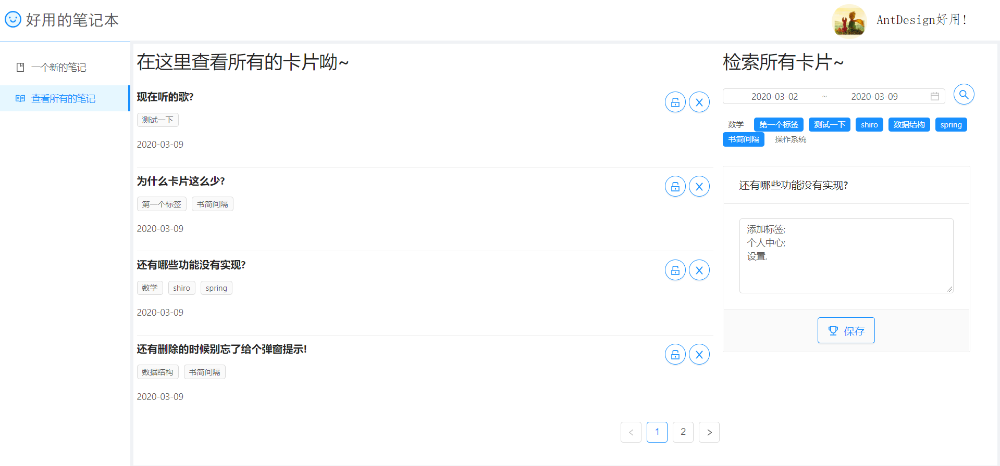
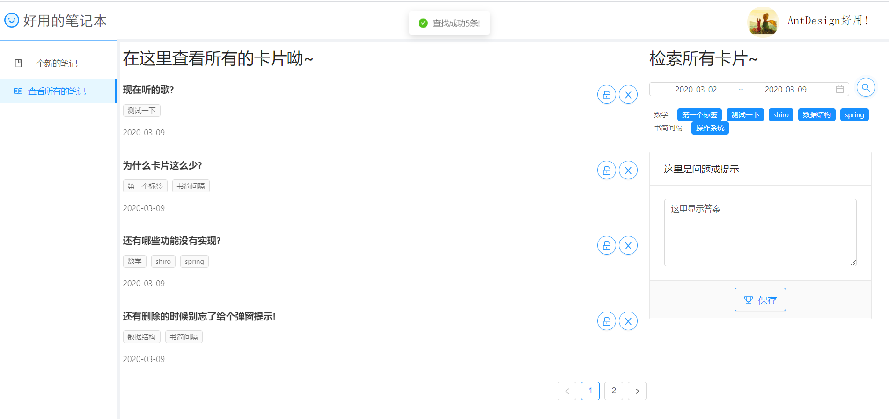
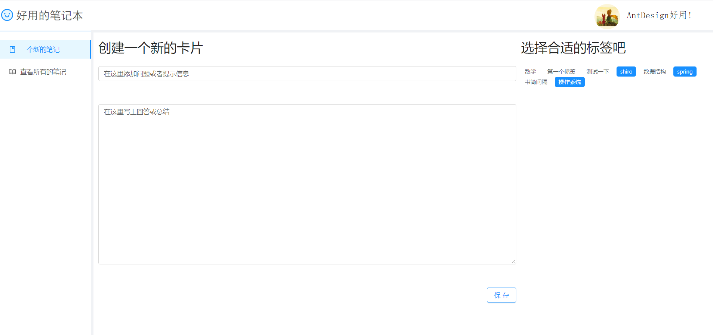
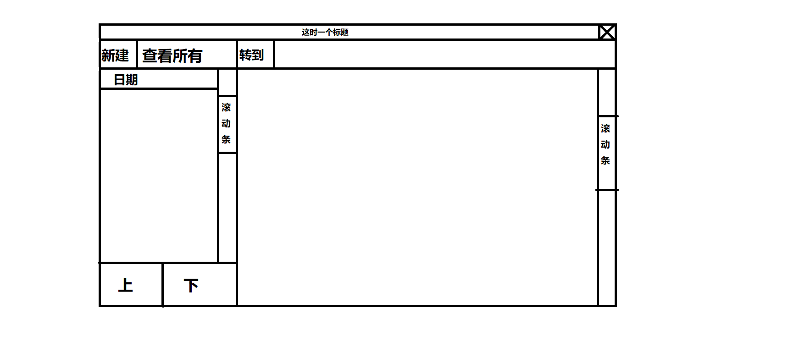
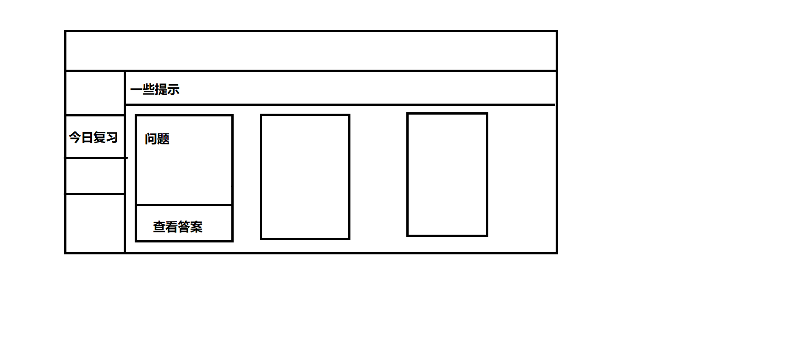
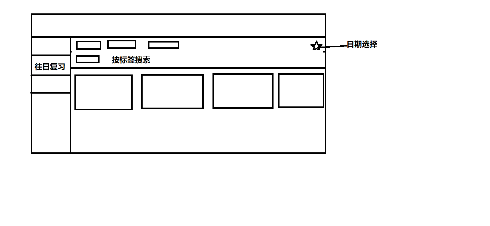

# handy-review-notebook-frontend

一个根据艾宾浩斯遗忘曲线复习的笔记本-前端部分

后端仓库: https://github.com/fffffengb/handy-review-notebook-backend

**注意:** 

**由于刚刚重构了后端部分代码, 故项目现在还无法正常运行**

**线上项目也还没来得及更新**

# 界面预览

- 在这里可以查看所有保存的卡片

  

- 点击"解锁"可以查看答案, 这时可以修改当前答案

  

- 点击"放大镜"可以按日期和标签检索所有符合条件的卡片

  

- 在这里编辑新的卡片

  

# 彩蛋

最开始的构思是这样的:

